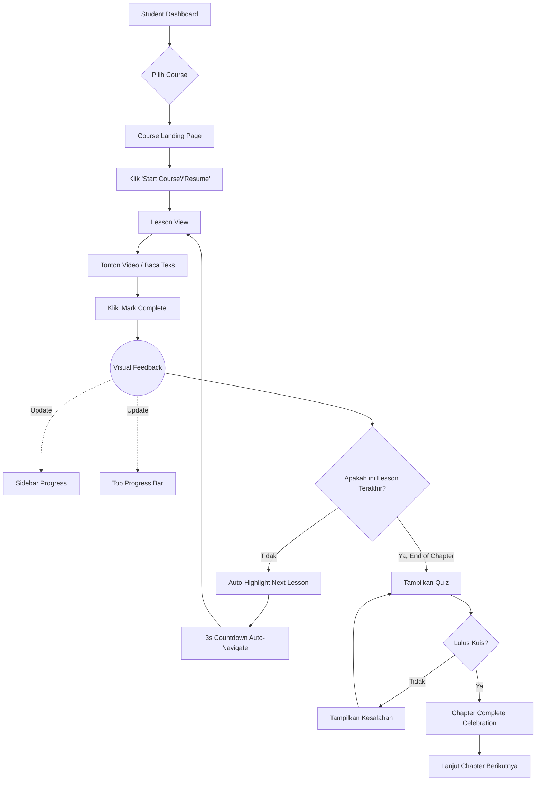
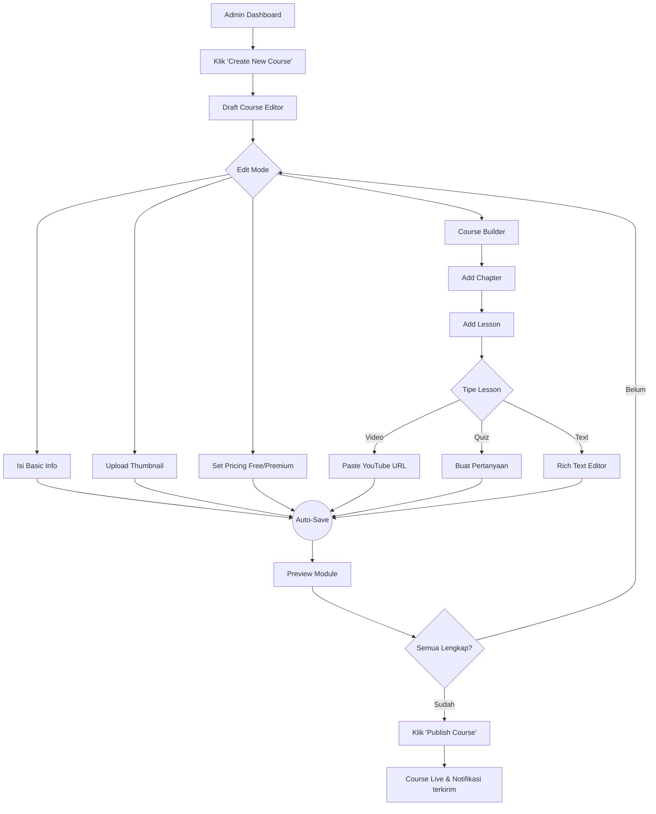

# UX Design Specification hiring-seefluencer

**Author:** Rio
**Date:** 2026-03-06

---

## Executive Summary

### Project Vision

hiring-seefluencer adalah platform e-course EdTech SaaS MVP yang menggabungkan dua identitas visual secara harmonis: "Creative Agency" untuk marketing surface dan "SaaS Productivity" untuk application core — menghadirkan wow factor instan sambil menjaga fokus pengguna saat belajar.

### Target Users

- **Student:** Tech-savvy learner yang mencari course berkualitas, menggunakan browser desktop/mobile, motivasi utama: progress yang terasa nyata.
- **Admin:** Content creator yang butuh CMS back-office yang efisien dan tidak membingungkan, fokus pada workflow pembuatan konten.

### Key Design Challenges

1. **Paywall Friction** — Menyajikan paywall premium yang persuasif, bukan agresif
2. **Content Hierarchy Navigation** — Course → Chapter → Lesson harus terasa intuitif
3. **Admin CMS Complexity** — Form bertingkat harus terstruktur jelas

### Design Opportunities

1. **Progress Gamification** — Animated progress bar sebagai core delight
2. **Global Dark Mode** — Polished di kedua mode sebagai first-class feature
3. **Zone-based Visual Identity** — Gradien hero yang bold vs clean app UI menciptakan pengalaman yang kaya tanpa noise

### Visual Design Decisions

- **Theme:** Hybrid "Expressive SaaS" — Creative Agency (landing) + SaaS Productivity (app core)
- **Gradient:** Coral → Purple → Teal (landing/marketing zones only)
- **Dark Mode:** Global switch — background `#0F0F14` + neon accent harmony, berlaku di seluruh app
- **Admin:** Pure SaaS minimal — white, 1px borders `#E5E7EB`, no decorations
- **Micro-interactions:** Landing page parallax & hover only
- **Typography:** Fraunces/Playfair Display (hero headlines) + Inter tight-tracking (body)
- **Accent:** Indigo `#6366F1` / Violet `#8B5CF6` for active states & CTAs

## Core User Experience

### Defining Experience

Inti pengalaman hiring-seefluencer berpusat pada dua loop utama:

- **Student Loop:** Buka lesson → Tonton/baca → Tandai selesai → Lanjut otomatis
- **Admin Loop:** Create course → Tambah chapter → Tambah lesson → Publish

### Platform Strategy

- **Platform:** Web browser, desktop-first dengan responsive mobile
- **Input:** Mouse/keyboard (desktop), touch (mobile)
- **Offline:** Tidak disupport (dependent on YouTube iframe)
- **Admin:** Optimized untuk desktop workflow

### Effortless Interactions

- **Mark as Completed:** 1 klik → instant feedback → auto-scroll ke lesson berikutnya
- **Progress bar:** Real-time update tanpa reload
- **Quiz result:** Instant score reveal dengan animasi pass/fail
- **Dark mode toggle:** Instan, persistent, zero flash
- **Paywall:** Muncul smooth, bukan hard-block — tampilkan value proposition

### Critical Success Moments

- **Landing Page First Load:** "Wow" dalam 3 detik — hero gradient + micro-animation
- **First Mark Complete:** Rewarding feedback — hook student ke habit loop
- **Quiz Passed:** UI celebrate momen triumph — confetti/glow effect
- **Checkout Berhasil:** Seamless Free → Premium transition, trustworthy
- **Admin Publish Course:** Visual confirmation bahwa konten live di publik

### Experience Principles

1. **"Progress First"** — Setiap interaksi membuat user merasa satu langkah lebih maju
2. **"Zero Confusion Navigation"** — Deep hierarchy (Course → Chapter → Lesson), tapi user selalu tahu posisinya via breadcrumb + sidebar
3. **"Earn Your Premium"** — Paywall adalah jembatan value, bukan wall
4. **"App is a Tool, Landing is a Stage"** — Ekspresif di landing, presisi di dalam app

## Desired Emotional Response

### Primary Emotional Goals

- **Landing Page:** Terpesona — "Ini beda dari e-course biasa"
- **Browsing Course:** Penasaran & Tertarik — "Saya mau coba ini"
- **Lesson Selesai:** Bangga & Accomplished — "Saya maju selangkah"
- **Quiz Passed:** Triumph — "Saya berhasil!"
- **Paywall:** Convinced, bukan Frustrated — "Ini worth it"
- **Post-Subscribe:** Empowered — "Sekarang saya punya akses penuh"
- **Admin:** Confident & In Control — "Saya tahu apa yang terjadi"

### Emotional Journey Mapping

```
Discover → Explore → Learn → Achieve → Subscribe → Mastery
   ↓           ↓         ↓        ↓           ↓         ↓
Terpesona  Penasaran  Fokus   Triumph   Empowered   Loyal
```

Error handling: User merasa "Oh saya mengerti" — bukan tersesat. Toast notification yang jelas + redirect sopan.

### Micro-Emotions & Design Implications

- **Confidence** → Breadcrumb + sidebar posisi yang selalu visible
- **Trust** → Consistent design language tanpa surprise
- **Excitement** → Hero gradient + scroll animation; confetti pada quiz passed
- **Accomplishment** → Animated progress bar yang berkilau saat naik persentase
- **Focus** → Lesson view distraction-free: sidebar hidden, dark bg, centered content
- **Delight** → Skeleton loaders beranimasi indah, bukan spinner biasa

### Emotions to Avoid

- **Frustrasi** — Form tidak jelas, error message generik, navigasi tersesat
- **Skeptis** — Pricing tidak transparan, paywall tiba-tiba tanpa preview
- **Overwhelming** — Admin CMS dengan terlalu banyak pilihan sekaligus
- **Bosan** — Loading tanpa feedback, transisi yang terlalu flat

### Emotional Design Principles

1. **Celebrate every win** — Sekecil apapun progress user, rayakan
2. **Never leave user stranded** — Selalu ada jalan pulang yang jelas
3. **Trust through consistency** — Design language harus predictable
4. **Delight in the details** — Animasi kecil yang tepat > dekorasi besar yang noisy

## UX Pattern Analysis & Inspiration

### Inspiring Products Analysis

**Udemy / Coursera** _(EdTech Benchmark)_

- ✅ Sidebar lesson navigator yang selalu visible — user tahu posisi mereka
- ✅ Progress bar per chapter yang terbagi jelas
- ❌ Anti-pattern: Terlalu cluttered, upsells di semua halaman

**Linear.app** _(SaaS Productivity Aesthetic)_

- ✅ Dark mode yang benar-benar polished, bukan afterthought
- ✅ Subtle micro-animations yang membuat UI terasa "alive"
- ✅ Typography Inter + tight spacing = premium feel tanpa dekorasi berlebihan

**Framer.com** _(Creative Agency + SaaS Hybrid)_

- ✅ Landing page stunning dengan gradient dan scroll animation — app-nya tetap clean
- ✅ Duality sempurna: marketing site ekspresif, app interface presisi

**Notion** _(Content Hierarchy Navigation)_

- ✅ Sidebar hierarki collapsible — navigasi dalam tidak terasa overwhelming
- ✅ Breadcrumb yang selalu contextual

### Transferable UX Patterns

**Navigation Patterns:**

- `Collapsible sidebar` (Notion/Udemy) → Lesson View: Course → Chapter → Lesson
- `Sticky breadcrumb` (Coursera) → Selalu tahu posisi di tree hierarki

**Interaction Patterns:**

- `Instant feedback on action` (Linear) → Mark Complete: immediate visual update tanpa reload
- `Progress ring per chapter` (Udemy) → Progress bar animated per course
- `Badge + pill untuk metadata` (Linear) → Tipe lesson (Video/Quiz/Text), status (Free/Premium)

**Visual Patterns:**

- `Gradient hero + clean app` (Framer) → Zone-based design strategy kita
- `1px border card system` (Linear) → Course cards di catalog

### Anti-Patterns to Avoid

- **Modal-heavy flows** — Menghentikan context; gunakan inline expansion
- **Upsell everywhere** — Merusak trust; paywall hanya di lesson premium
- **Generic spinner** — Membosankan; ganti dengan skeleton loaders per layout
- **Multi-step form wizard panjang** — Admin CMS frustration; gunakan auto-save inline editing
- **No empty states** — Blank screens = confusion; setiap empty state punya illustration + CTA

### Design Inspiration Strategy

**Adopt langsung:**

- Sidebar lesson navigator (Udemy style) untuk learning platform
- Dark mode implementation quality (Linear standard)
- Gradient landing + clean app duality (Framer approach)

**Adapt untuk konteks kita:**

- Notion sidebar hierarki → disederhanakan 3 level saja (Course/Chapter/Lesson)
- Coursera progress tracking → dipadatkan jadi 1 animated progress bar

**Hindari:**

- Coursera's cluttered upsell pattern
- Generic loading spinners
- Multi-step form wizard untuk admin CMS

## Design System Foundation

### Design System Choice

**shadcn/ui** sebagai base component library, di atas Radix UI primitives dan Tailwind CSS, dengan custom design tokens untuk mendukung zona-zona visual yang berbeda.

### Rationale for Selection

- **Headless by design** — Mendukung zone-based theming: landing expressive vs app/admin clean
- **Dark mode native** — Integrasi mulus dengan `next-themes`, zero additional config
- **PRD-aligned** — Eksplisit disebutkan `Radix/shadcn` di PRD sebagai pilihan komponen
- **Timeline-friendly** — Komponen siap pakai, tidak perlu build dari nol dalam 7 hari
- **Badge & pill built-in** — Perfect untuk SaaS Productivity zone (tipe lesson, status akses)

### Implementation Approach

```
Design Layer Stack:
├── shadcn/ui        → Base components (Button, Card, Badge, Input, Progress, dll)
├── Radix UI         → Headless primitives (Dialog, Dropdown, Tooltip)
├── Tailwind CSS     → Utility styling + custom design tokens
├── next-themes      → Global dark/light mode switch
└── CSS Variables    → Design token definitions
```

**Custom Design Tokens:**

- `--color-coral: #FF6B6B`
- `--color-purple: #9B59B6`
- `--color-teal: #1ABC9C`
- `--color-indigo: #6366F1` (primary accent)
- `--color-violet: #8B5CF6` (secondary accent)
- `--color-bg-dark: #0F0F14`
- `--color-border: #E5E7EB`

### Customization Strategy

- **Landing Zone:** Override shadcn components dengan gradient backgrounds, large border-radius, organic blob shapes via CSS clip-path/SVG
- **App Zone:** shadcn defaults dengan 1px `#E5E7EB` border, subtle shadows, tight Inter tracking
- **Admin Zone:** Ultra-minimal shadcn — white bg, `#E5E7EB` borders only, no decorative elements

## Defining Core Experience

### 2.1 Defining Experience

**"Learn → Complete → Progress"** — Loop yang harus terasa instant, visual, rewarding.
Seperti "menekan tombol yang memuaskan" — inilah hook utama student yang membuat mereka ketagihan melanjutkan.

### 2.2 User Mental Model

User datang dengan mental model dari YouTube + Duolingo:

- **Ekspektasi:** Klik → langsung main → progress lanjut otomatis
- **Frustrasi di kompetitor:** Reload antar lesson, progress tidak live-update, navigasi membingungkan
- **Solusi kita:** Instant feedback, no-reload progress, auto-next navigation dengan countdown

### 2.3 Success Criteria

| Kriteria                        | Target                                     |
| ------------------------------- | ------------------------------------------ |
| Lesson load                     | < 500ms (skeleton → content)               |
| Mark Complete → progress update | Instant, no reload                         |
| Auto-navigate ke next lesson    | 2-3 detik delay dengan countdown indicator |
| Quiz → hasil                    | Instant dengan animasi pass/fail           |
| Location awareness              | Selalu via breadcrumb + sidebar sync       |

### 2.4 Pattern Analysis

**Established (tidak perlu user education):**

- Sidebar lesson navigator (Udemy/Coursera)
- Linear progress bar
- Multiple choice quiz

**Novel twist:**

- Animated progress bar "glow" saat persentase naik
- Elegant paywall: blur overlay + CTA (bukan hard redirect)

### 2.5 Experience Mechanics

**Lesson Learning Flow:**

1. **Initiation:** Student klik lesson di sidebar → skeleton loader muncul immediate
2. **Interaction:** Konten tampil (video embed + teks) → student tonton/baca → tombol "Mark Complete" sticky di bottom
3. **Feedback:** Checkmark animation → sidebar item update → progress bar fill animated dengan glow → toast notification
4. **Completion:** Auto-highlight next lesson di sidebar + optional 3s auto-navigate dengan countdown indicator

## Visual Design Foundation

### Color System

**Brand Palette — Hybrid "Expressive SaaS"**

- **Decorative (Landing):** Coral `#FF6B6B`, Purple `#9B59B6`, Teal `#1ABC9C` (Digunakan untuk gradient hero dan accent blobs)
- **Semantic (App-wide):**
  - Primary (CTA & Active): Indigo `#6366F1`
  - Secondary (Hover): Violet `#8B5CF6`
  - Success: `#22C55E`
  - Warning: `#F59E0B`
  - Destructive: `#EF4444`
- **Background:**
  - Light mode: `#FAFAFA` (page) / `#FFFFFF` (card)
  - Dark mode: `#0F0F14` (page) / `#1A1A24` (card)
  - Admin: `#FFFFFF` (always light, professional feel)
- **Borders:** `#E5E7EB` (Light) / `#2A2A3C` (Dark)

### Typography System

- **Display Typeface (Landing Hero):** `Playfair Display` atau `Fraunces` (Bold/Black) — memberikan sentuhan editorial/agency.
- **Body Typeface (App-wide):** `Inter` dengan tracking tight (`-0.02em`) — clean, legible, information-dense SaaS look.
- **Type Scale:**
  - h1: 36px/700
  - h2: 28px/600
  - h3: 22px/600
  - body: 15px/400 (Line height 1.6)
  - small/badge: 13px/500

### Spacing & Layout Foundation

- **Base Unit:** 4px (Tailwind standard)
- **Spacing Scale:** `xs`(4px), `sm`(8px), `md`(16px), `lg`(24px), `xl`(32px), `2xl`(48px)
- **Border Radius:**
  - Landing: 24px–40px (large, organic)
  - App: 8px–12px (shadcn default, structured)
  - Pill/Badge: 9999px (fully rounded)
- **Shadows:** Sangat subtle (e.g. `0 1px 3px rgba(0,0,0,0.08)`); Admin zone full border-only tanpa shadow untuk kesan utility.

### Accessibility Considerations

- Contrast ratio WCAG AA untuk semua text-to-background combinations.
- Visible focus rings `outline-indigo-500` di setiap interactive element (shadcn default).
- Font size minimum `13px` untuk legibility.
- Transisi motion dibatasi maksimal 300ms.

## Design Direction Decision

### Design Directions Explored

Dua arah desain utama dieksplorasi via HTML mockup interaktif (`ux-design-directions.html`):

1. **The Hybrid Duality:** Pemisahan tegas antara eksekusi Landing Page bergaya _Creative Agency_ (Fraunces, Blur Gradient, Large Radius) dengan App Zone bergaya _SaaS Productivity_ (Inter, 1px border, utilitas tinggi).
2. **Global Dark Mode:** Eksplorasi estetika pure dark mode untuk app dan kontrasnya dengan Admin panel yang always-light.

### Chosen Direction

**Direction 1: The Hybrid Duality** telah dipilih dan disetujui tanpa modifikasi.

### Design Rationale

Pendekatan ini dipilih karena secara sempurna mengeksekusi visi PRD:

- **Landing Page** memukau visitor (calon student) dengan estetika premium yang meyakinkan mereka akan kualitas konten.
- **App/Learning Zone** memastikan ketika student mulai belajar, tidak ada distraksi visual; UI mundur ke belakang (invisible UI) agar fokus sepenuhnya pada materi video dan kuis.
- **Admin Zone** diposisikan murni sebagai alat kerja (SaaS tool) yang mengutamakan kecepatan input dan manajemen data.

### Implementation Approach

- **Landing:** Gunakan tag `font-display` kustom di Tailwind, setup SVG clip-path blobs sebagai background elemen dekoratif.
- **App:** Gunakan shadcn default styling, override beberapa warna active state dengan Indigo/Violet.
- **Dark Mode:** Tetap diimplementasikan sebagai opsi toggle global di App Zone menggunakan konfigurasi dari Step 8.

### Landing Page Information Architecture

Recommended order for route `/`:

1. **Public Navbar**
   - Left: `Seefluencer` text logo
   - Center: `Home`, `Courses`, `Pricing`
   - Right: signed-in profile name when session exists, otherwise auth CTA
2. **Hero Section**
   - premium value proposition
   - primary CTA to Courses
   - secondary CTA to Pricing or preview flow
3. **Value Proposition / Benefits**
   - why this platform is different
   - progress-first and premium learning feel
4. **Featured Course / Learning Highlights**
   - curated showcase aligned to EdTech context
5. **Trust / Social Proof / Reviewer Confidence Layer**
   - credibility indicators, product strengths, learning outcomes, or quality markers
   - may use dummy data during MVP implementation if production data is not yet available
6. **Pricing Bridge CTA**
   - smooth upsell entry without aggressive hard-sell
7. **Footer / Final CTA**

### Public Navbar Behavior

- Navbar harus terasa clean dan premium, bukan dashboard-like
- Signed-in state tetap mempertahankan fokus marketing surface
- Pada mobile, navigation dapat collapse menjadi drawer/sheet tetapi tetap mempertahankan CTA clarity
- Current section highlighting atau smooth anchor navigation diperbolehkan bila membantu orientation

### Motion Guardrails

- Smooth scroll, parallax, progress reveal, dan lightweight 3D visual enhancement boleh digunakan
- Implementasi boleh menggunakan pendekatan dekoratif berbasis three.js selama tetap ringan dan non-blocking
- Motion tidak boleh:
  - mengurangi keterbacaan
  - menutup CTA penting
  - memicu layout shift berlebihan
  - menjadi syarat agar konten utama dapat dipahami
- Reduced-motion friendly behavior harus dipertahankan

### Accessibility Guardrails for Landing

- Hero dan CTA tetap readable di light/dark contexts
- Focus order keyboard tetap logis dari navbar ke hero ke section CTA
- Decorative blobs, parallax layers, atau 3D ornaments harus bersifat non-essential terhadap comprehension

## User Journey Flows

### Journey 1: The Learning Loop (Student)

**Goal:** Student membuka course, menonton lesson, menandai selesai, dan otomatis lanjut ke materi berikutnya tanpa hambatan.



### Journey 2: The Publishing Pipeline (Admin)

**Goal:** Admin (Content Creator) membuat course baru, mengunggah video, dan mengatur harga tanpa terjebak di multi-step form yang panjang.



### Journey Patterns

1. **Inline Feedback Pattern:** Setiap aksi sukses (Mark Complete, Auto-Save) memberikan feedback visual instan di posisi krusial (bukan sekadar toast tersembunyi).
2. **Sidebar Primacy Pattern:** Sidebar selalu menjadi _source of truth_ navigasi (struktur course bagi student, struktur modul bagi admin).

### Flow Optimization Principles

- **Efficiency (Admin):** Single Master View dengan auto-save inline editing menghapus kebutuhan memuat form berhalaman-halaman.
- **Delight (Student):** Auto-navigate memberikan feeling "effortless progression" seperti Netflix autoplay, meminimalkan jumlah klik.

## Component Strategy

### Design System Components (shadcn/ui)

Foundation components yang akan langsung di-install dari shadcn/ui dan direstyle sesuai token di Step 8:

- **Button:** `default` (Indigo CTA), `secondary` (gray hover), `destructive` (Admin delete actions)
- **Card:** Wrapper utama untuk Course Item di dashboard dan catalog
- **Badge & Pill:** Metadata labels ("Free", "Premium", "Video", "Quiz")
- **Progress:** Horizontal progress bar untuk tracking course
- **Form Elements:** Input, Textarea, Select, Label (Nyawa dari Admin CMS)
- **Skeleton:** Loading placeholders (pengganti spinner konvensional)
- **Toast/Sonner:** Notifikasi pojok layar (contoh: "Auto-saved", "Lesson completed!")
- **Breadcrumb:** Orientasi lokasi student

### Custom Components (To Build)

Komponen spesifik domain yang tidak tersedia di shadcn/ui:

**1. CourseSidebarNav**

- _Purpose:_ Navigasi hirarki Course → Chapter → Lesson.
- _Anatomy:_ Collapsible accordion list dengan indikator ikon (play/document/help) dan status checkmark.
- _Behavior:_ Auto-scroll ke lesson aktif, highlight lesson saat diklik.

**2. VideoPlayerWrapper**

- _Purpose:_ Membungkus YouTube iframe agar responsif dan aman dari aspect-ratio breakage.
- _Variants:_ Normal state vs Paywalled state.

**3. PaywallTeaserOverlay**

- _Purpose:_ Membatasi konten tanpa merusak UX navigasi.
- _Anatomy:_ Elemen absolut dengan backdrop-blur, ikon gembok elegan, penjelasan (contoh: "This lesson is for Pro members"), dan tombol Premium CTA.

**4. QuizEngine**

- _Purpose:_ Assessment engine untuk tipe lesson kuis.
- _Anatomy:_ Form radio button untuk jawaban, state evaluasi instan (hijau/merah), dan visualisasi skor akhir animasi ring-chart.

**5. NavbarProfileDropdown**

- _Purpose:_ Merapikan Navbar dengan menyembunyikan aksi akun (Profile, Sign Out) ke dalam dropdown untuk mengurangi _visual noise_ dan menjaga fokus student. Menerapkan "SaaS Productivity" aesthetic.
- _Anatomy:_ Menggunakan komponen `DropdownMenu` dan `Avatar` dari shadcn/ui. Trigger berupa Avatar bulat dan Nama User. Menu berisi Header (Nama & Email), Separator, dan Item Aksi (Profile, Sign Out dengan teks merah/destructive).
- _Behavior & Responsive:_
  - Muncul saat **diklik**, bukan _hover_ (ramah _touchscreen_).
  - _Desktop_: Dropdown sejajar di sisi kanan atas dengan _subtle shadow_.
  - _Mobile (< 768px)_: Tap target diperbesar (minimal 44x44px). Jika layar terlalu kecil, dropdown menyesuaikan lebar layar atau tetap _dropdown_ proporsional agar mudah ditekan jari.

### Component Implementation Strategy

Pendekatan _pragmatic-first_ untuk mencapai deadline 7 hari MVP:

- Jangan _reinvent the wheel_: Apapun yang bisa diselesaikan dengan native HTML/Tailwind atau shadcn, jangan buat custom component yang rumit.
- Semua state `active`, `focus`, dan `error` dari custom component wajib menggunakan token warna semantic dari Step 8.

### Implementation Roadmap

- **Phase 1 (Core Blocks):** Setup struktur dasar dan Shadcn instalasi. Build `CourseSidebarNav`.
- **Phase 2 (Learning Experience):** Build `VideoPlayerWrapper`, `PaywallTeaserOverlay`, dan versi dasar dari `QuizEngine`.
- **Phase 3 (Admin & Polish):** Form CMS Admin menggunakan shadcn forms, implementasikan skeleton loaders, rapikan edge cases.

## UX Consistency Patterns

### Button Hierarchy

- **Primary Action (Satu per layar):** Solid warna utama (Target: Indigo `bg-indigo-600`). Digunakan untuk aksi utamaseperti _Start Course_, _Mark Complete_, _Publish Course_.
- **Secondary Action:** Outline atau Soft/Ghost background. Digunakan untuk aksi pendukung seperti _Cancel_, _Back_, _Preview_.
- **Destructive Action:** Red Solid/Outline. Selalu membutuhkan konfirmasi (Dialog "Are you sure?").
- **Placement:** Tombol aksi utama form/dialog selalu ditempatkan di **kanan bawah**.

### Feedback Patterns

- **Inline Feedback (Primary):** Perubahan visual langsung pada elemen yang diinteraksi. Contoh: Gembok abu-abu berubah menjadi Checkmark hijau instan saat kuis di-submit.
- **Toast / Sonner (Secondary):** Notifikasi _non-blocking_ di pojok bawah untuk proses background yang sukses (contoh: "Draft saved automatically", "Lesson marked as complete").
- **Error Feedback:** Harus jelas letak kesalahannya (highlight input merah) dan memberikan pesan yang solutif (bukan sekadar kode error).

### Form Patterns

- **No Blank Screens / Empty States:** Layar yang belum ada datanya (misal: Course belum dibeli, katalog kosong) wajib menampilkan ilustrasi yang _delightful_ disertai satu tombol Call-to-Action.
- **Form Validation:** Menggunakan validasi _on-blur_ (saat fokus berpindah dari input), menahan error message hingga user selesai mengetik.
- **Auto-save First (Admin):** Tidak ada tombol "Save" manual untuk update teks/konten. Sistem menggunakan _debounce_ yang memicu auto-save tiap ada jeda ketikan.

### Navigation Patterns

- **Breadcrumb:** Wajib hadir di top-bar area App Zone sebagai anchor lokasi hirarki user (`Courses / React Mastery / Intro`).
- **Sidebar State:**
  - Desktop: Selalu open (pinned) sebagai navigasi utama.
  - Mobile: Berubah menjadi Drawer menu yang bisa di-toggle.
- **Sticky Elements:** Area aksi kritikal (seperti tombol "Mark Complete" di artikel panjang) harus di-set _sticky_ agar user tidak kepayahan melakukan scroll up/down jauh.

## Responsive Design & Accessibility

### Responsive Strategy

**Mobile-First Approach untuk Student, Desktop-First untuk Admin:**

- **Mobile (< 768px):**
  - Landing: Teks hero downscale (56px → 36px), form memanjang penuh (full width).
  - App Zone: Video Player mendominasi layar atas (100% width). Sidebar course collaps masuk ke laci _Bottom Sheet_ yang ramah ibu jari (seperti UI YouTube App).
- **Tablet (md: 768px+):** Layout grid mulai terbentuk. Sidebar muncul tapi bisa berupa mode compact (hanya icon). Katalog kursus ditampilkan 2 kolom.
- **Desktop (lg: 1024px+):** Sidebar kiri terbuka penuh (fixed 280px), Video Player membesar maksimal mengambil sisa ruang area utama. Admin Zone dioptimasi penuh di ukuran ini ke atas untuk mengelola CMS yang kompleks.
- **Large Desktop (xl: 1280px+):** Kontainer diberikan `max-width` ekstrim agar layout tidak merenggang tidak sedap dipandang walau user menggunakan monitor ultra-wide.

### Breakpoint Strategy

Menggunakan standar tailwind:

- `sm`: 640px
- `md`: 768px (Tablet)
- `lg`: 1024px (Laptop)
- `xl`: 1280px (Desktop wide)
- `2xl`: 1536px (Ultra wide)

### Accessibility Strategy

Platform menargetkan tingkat kepatuhan **WCAG AA** (standar industri SaaS):

- **Color Contrast:** Palet minimal rasio 4.5:1 untuk teks normal vs background pada setiap state (Light & Dark).
- **Keyboard Navigation:** User dapat pindah dari navigasi sidebar ke area kontrol video player hanya menggunakan tombol Tab. Fitur _Skip to Content_ wajib disediakan.
- **Focus Identifiers:** Kotak penanda (Focus ring) default ketat Shadcn (ring-indigo-500) akan dipertahankan.
- **Touch Target:** Untuk mobile, semua elemen interaksi minimal `44x44px` agar menghindari salah klik (fat-finger errors).

### Testing Strategy

- Device Lab internal (iOS/Android) untuk validasi behavior _Bottom Sheet_ di mobile player.
- Lighthouse Score target: Accessibility 100/100.
- Manual Keyboard Navigation pass (pengujian tanpa mouse untuk entire flow belajar).

### Implementation Guidelines

- Gunakan class standard Tailwind (misal `@apply text-base md:text-lg`) untuk fluidity typography.
- Implementasi `aria-label` wajib di-state untuk icon-only buttons (misal: Icon Silang tanpa teks > aria-label="Tutup form").
- Hindari scroll-lock yang tidak lazim di Mobile yang mengunci layar user di posisi yang aneh.

---

> **🎉 WORKFLOW STATUS: UX DESIGN SPECIFICATION COMPLETE**
> Spesifikasi desain UX ini sekarang resmi dikunci dan menjadi landasan tunggal untuk seluruh pengerjaan High-Fidelity UI dan pembangunan aplikasi tahap selanjutnya.

<!-- UX design content will be appended sequentially through collaborative workflow steps -->
